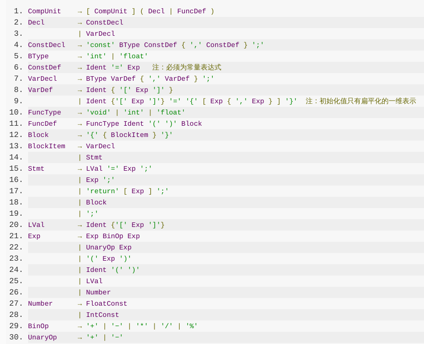
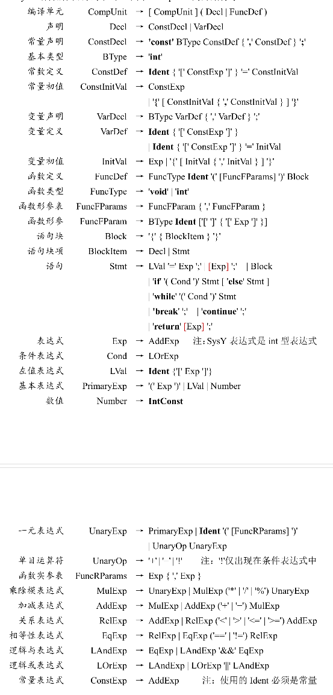

# Maho_Shojo
Maho_Shojo compiler 欢迎来到魔法少女的世界~

# References
竞赛所需资料
https://gitlab.eduxiji.net/nscscc/compiler2021/-/tree/master

[./references/checker_example] 是上学期编译实验例子。前端实现时可参考

实验文法与SysY文法的不同之处：
实验文法

SysY文法

要修改的部分：
1. Btype修改为只有int
2. ConstDef要支持数组
3. 增加ConstInitVal
4. VarDef中修改为const exp
5. 增加InitVal
6. FuncDef要支持参数
7. FuncType只有Int和Void
8. 增加FuncFparams,FuncFparam，FuncRarams
9. BlockStmt中改为Decl和Stmt
10. Stmt中加入if-else,while,break,continue
11. 加入逻辑表达式，常量(数值)表达式,关系表达式，基本表达式，等性表达式等(expr部分要重构?)

此法分析部分要增加
1. &&
2. ||
3. ！=
4. ==
5. ！
6. if
7. else
8. while
9. break
10. continue

待补充

# 魔法少女调教日志
> 06.06 完成词法、语法分析，语法树构建、TreePrinter,简单的语义检查checker。

# 魔法少女育成指南
```shell
$ mkdir build
$ cd build
$ cmake ..
$ make
```

# 魔法少女使用指南
```shell
$ cd build
$ ./MHSJchecker [-e] [-p] [-h] <SourceFile>
```