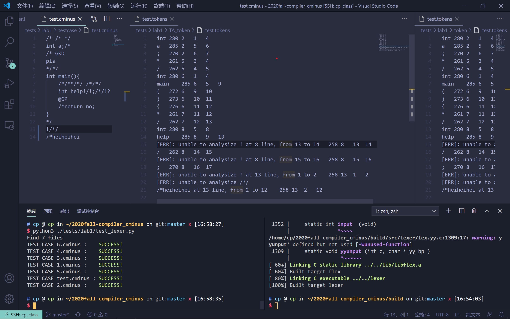

# lab1实验报告
PB18111719 黄庄湫
## 实验要求
本次实验需要根据`cminus-f`的词法补全[lexical_analyer.l](../../src/lexer/lexical_analyzer.l)文件，完成词法分析器，能够输出识别出的`token`，`type` ,`line(刚出现的行数)`，`pos_start(该行开始位置)`，`pos_end(结束的位置,不包含)`。
## 实验难点
实验难点在于注释的正则表达式及其相应动作，以及随之而来的注释不完整时的匹配规则
## 实验设计
除了注释以外的其他规则按照助教文档中提供的规则实现即可，由于`C MINUS`不支持科学计数法，所以不需要考虑其实现。
在注释部分，使用的是HW1题2.4c的实现。在C语言中，注释不完整仅有有前导"/\*"但缺失与其匹配的"\*/"这一种情况(返回ERROR)，对于只有"\*/"但缺失前导"/\*"的情况，C语言中并不将其识别为注释不完整的情况，给出的错误信息仅为表达式不完整，所以将注释规则的结束标志"\*/"从规则中删去即为注释不完整时的匹配规则。
对于注释，为了计算注释结束后的文本的开始位置，需要通过yytext指针将注释传入函数进行分析，遇到换行符"\n"时增加lines，并重置该行的开始和结束位置。
对于注释嵌套的情况，如"/\*/\*...\*/\*/"，分析器会将"/\*/\*...\*/"识别为注释，而剩下的"\*/"则会识别为"\*"和"/"两个符号。
## 实验结果验证
测试中使用的是[issue #54 Lab 1 自动评测脚本](http://222.195.68.197/staff/2020-fall-notice_board/-/issues/54)提供的代码。
以下是测试截图(图中为自己写的测试样例，主要关注注释未闭合以及注释嵌套的情况。文本放在test.cminus中)：

## 实验反馈
助教提供的文档比较全面，再加上同学们提出的issues，可以较好地完成实验。助教提供的测试样例可以更多样化，覆盖更多可能的易错点，让我们发现原本自己可能考虑不周的地方。