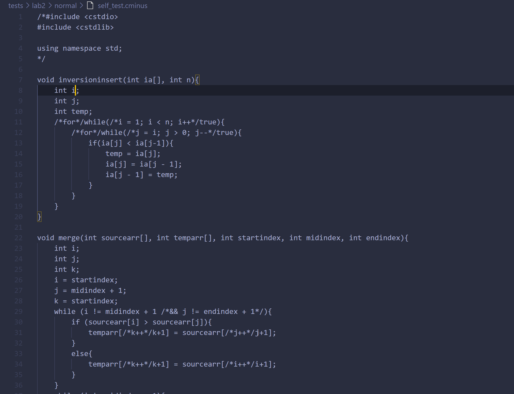
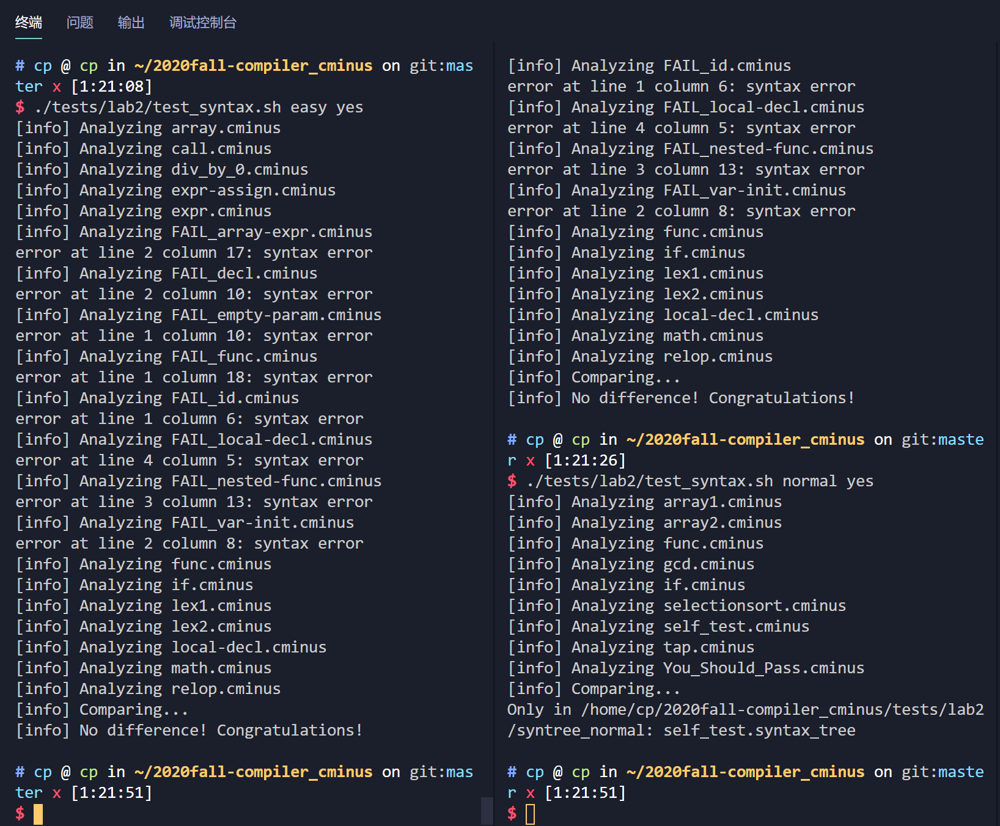
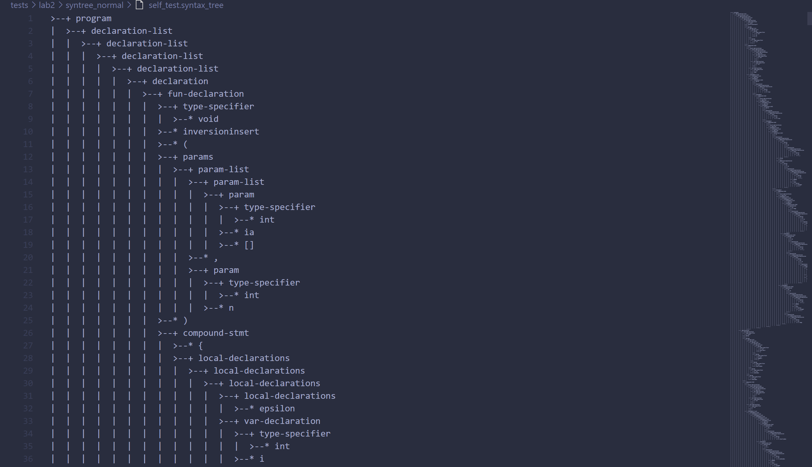

# lab2 实验报告
PB18111719 黄庄湫
## 实验要求
本次实验需要在 Lab1 已完成的 `flex` 词法分析器的基础上，进一步使用 `bison` 完成语法分析器。
本次实验需要首先将自己的 lab1 的词法部分复制到 `/src/parser` 目录的 [lexical\_analyzer.l](./src/parser/lexical\_analyzer.l)并合理修改相应部分，然后根据 `cminus-f` 的语法补全 [syntax\_analyzer.y](./src/parser/syntax_analyzer.y) 文件，完成语法分析器，要求最终能够输出解析树。
## 实验难点
本次实验的难点主要在于细节,许多出错的地方后来都发现是粗心导致的,但实验整体的难度不是很大
## 实验设计
实验设计分为3个部分:lexical_analyzer.l、syntax_analyzer.y和自己的测试样例的设计。
首先是lexical_analyzer.l的设计:在文件中粘贴lab1的词法部分,并将原先统一放在analyzer函数中的操作分别放入每条规则对应的动作中,并使用pass_node()函数传递结果。
对于有词法错误的情况,不能输出语法树,便在处理词法错误的规则(ERROR和HALF_COMMENT)对应的动作中输出错误信息并使用exit()函数退出。
对于syntax_analyzer.y文件,根据[issue #109](http://222.195.68.197/staff/2020-fall-notice_board/-/issues/109)中[dueToLife](http://222.195.68.197/PB18151858)同学的回答,在文件中添加`extern FILE* yyin;`
根据本次实验的设计,文法符号的语义值即为语法树上的结点。
在文法规则对应的动作中,使用node()函数创建语法树的结点并将其传递给文法符号。
对于我自己的测试样例,我使用了自己以前的C++代码,并将其中不符合`cminus-f`词法和语法的部分注释或调整了,确保代码符合`cminus-f`的词法和语法规则,能输出语法树。
由于我在./tests/lab2/normal文件夹中创建了self_test.cminus文件进行测试,但并没有在./tests/lab2/syntree_normal_std文件夹中提供相应的标准语法树,所以在接下来的实验结果验证部分会出现下面的信息(输入命令为`./tests/lab2/test_syntax.sh normal yes`):
`Only in /home/cp/2020fall-compiler_cminus/tests/lab2/syntree_normal: self_test.syntax_tree`
但是手动查看该文件,可以发现已经生成了语法树。
## 实验结果验证
请提供部分自己的测试样例
部分测试样例如下(只截图了一部分)

以下是验证结果,可以看到在第2列中,失败的只有我自己提供的测试样例(由于我并没有提供标准的语法树进行对比)

但是手动查看该文件,可以看到生成的语法树

## 实验反馈
本次实验难度不大,助教的文档写的十分详细,并且同学们提的issues也让我受益匪浅,本次实验的难度因此迅速降低,但与此同时,也让我们学到了许多新知识,更深入地了解bison的工作方式,为后面的实验打下基础。
